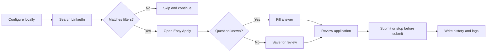

# Auto Job Applier for LinkedIn

<div align="center">

### A calmer way to manage your job search

Configure once, review your choices, and let a local browser automation tool handle repetitive LinkedIn Easy Apply steps while you stay in control.

[](https://www.python.org/)
[](LICENSE)
[](https://www.linkedin.com/)

**Local-first. Configurable. Reviewable.**

[Quick start](#quick-start) · [How it works](#how-it-works) · [Configuration](#configuration) · [Safety](#safety--boundaries) · [Troubleshooting](#troubleshooting)

</div>

> **Important:** This tool automates actions in your LinkedIn account. Use it thoughtfully, review every setting before running it, and follow LinkedIn's Terms of Service and applicable laws. You are responsible for your account and applications.

## What you get

- **A local control panel** for account, profile, search, filters, run settings, and application history.
- **Targeted search** by title, location, experience, work setting, salary, company, and posting date.
- **Resume and question handling** for common Easy Apply forms, with a review queue for questions it cannot answer confidently.
- **Optional AI assistance** through OpenAI-compatible providers, DeepSeek, Gemini, Ollama, or LM Studio.
- **Human-readable output** in `all excels/`, including applied jobs, failed applications, and questions to review.

## Quick start

### 1. Prerequisites

- Python 3.10 or newer
- Google Chrome
- A LinkedIn account

### 2. Launch the local control panel

Use the launcher for your operating system. It creates a private virtual environment, installs dependencies, and opens the panel in your browser.

<details>
<summary><strong>Windows</strong></summary>

Double-click [`start.bat`](start.bat), or run:

```powershell
./start.bat
```
</details>

<details>
<summary><strong>macOS</strong></summary>

Double-click [`start.command`](start.command), or run:

```bash
chmod +x start.command
./start.command
```
</details>

<details>
<summary><strong>Linux</strong></summary>

```bash
chmod +x start.sh
./start.sh
```
</details>

### 3. Complete your setup

In the browser panel, work through these tabs:

1. **Account** - optional LinkedIn credentials and optional AI settings.
2. **Profile** - personal details, work authorization, salary, notice period, and resume path.
3. **Search** - titles, location, experience, job type, and work setting.
4. **Filters** - companies and job-description terms to include or skip.
5. **Run settings** - conservative limits and review behavior.

Save your changes, verify the values, and start with a small search scope.

## How it works



The bot uses your configured profile and answer bank, uploads the configured resume when needed, and records outcomes locally. AI is optional; the core workflow does not require an AI provider.

## Configuration

The browser panel is the recommended path. It writes to [`user_config.json`](user_config.json) and overlays the defaults in `config/` without changing the source configuration files.

For direct configuration or deeper control, use the focused guides:

| Area | Guide |
| --- | --- |
| Installation and manual launch | [`docs/install.md`](docs/install.md) |
| All configuration concepts | [`docs/configuration.md`](docs/configuration.md) |
| Personal details | [`docs/config-personals.md`](docs/config-personals.md) |
| Application answers | [`docs/config-questions.md`](docs/config-questions.md) |
| Search and filters | [`docs/config-search.md`](docs/config-search.md) |
| LinkedIn and AI credentials | [`docs/config-secrets.md`](docs/config-secrets.md) |
| Runtime behavior | [`docs/config-settings.md`](docs/config-settings.md) |

### Resume setup

Put your PDF resume inside the project, for example:

```text
all resumes/default/resume.pdf
```

Then set the relative path in the panel, or in the configuration:

```python
default_resume_path = "all resumes/default/resume.pdf"
```

### Optional AI setup

Turn on **Use AI** only after configuring a supported provider and model. Local providers can use an OpenAI-compatible endpoint; cloud providers require their own API key. Never commit credentials or share `user_config.json` when it contains secrets.

## Outputs and controls

| Location | Purpose |
| --- | --- |
| `all excels/all_applied_applications_history.csv` | Applications completed by the bot |
| `all excels/all_failed_applications_history.csv` | Applications that could not be completed |
| `all excels/questions_to_review.csv` | Questions that need your answer or review |
| `all excels/question_answers.csv` | Reusable answers learned from reviewed questions |
| `logs/` | Runtime logs and screenshots |

Use `stop_before_submit` when you want a review-only run. Start with a narrow search and a low application limit while you validate your profile, resume, filters, and answers.

## Safety & boundaries

- This project runs locally and the control panel binds to `127.0.0.1`.
- Credentials and configuration stay on your computer unless you choose to send data to an enabled AI provider.
- The tool does not guarantee application quality, eligibility, interviews, or employment outcomes.
- Review generated answers and submitted applications. Do not rely on automation for legal, immigration, salary, or identity decisions.
- Respect LinkedIn's rules, rate limits, and any employer-specific application requirements.

## Troubleshooting

<details>
<summary><strong>The panel does not open</strong></summary>

Run `python app.py` from the project directory and open the local URL printed in the terminal. If the default port is busy, the app chooses another available port.
</details>

<details>
<summary><strong>Chrome or the driver fails</strong></summary>

Confirm that Google Chrome is installed and up to date. By default, the project manages a matching Chrome driver automatically. See [`docs/install.md`](docs/install.md) for manual driver settings.
</details>

<details>
<summary><strong>An application is skipped</strong></summary>

Check the run log, then inspect `all excels/questions_to_review.csv`. Add stable answers to the answer bank or adjust the relevant profile and filter settings before running again.
</details>

<details>
<summary><strong>I want to test without submitting</strong></summary>

Enable `stop_before_submit` in the run settings, use a small search, and review the populated application before changing the setting back.
</details>

## Manual launch

```bash
python -m venv .venv

# Windows PowerShell
.venv\Scripts\Activate.ps1

# macOS / Linux
# source .venv/bin/activate

python -m pip install -r requirements.txt
python app.py
```

The classic bot entry point is also available:

```bash
python runAiBot.py
```

## Contributing

Bug reports, documentation improvements, and focused pull requests are welcome. Start with [`CONTRIBUTING.md`](CONTRIBUTING.md), keep changes scoped, and never include credentials, private resumes, or application history in a pull request.

## License and support

Released under the [MIT License](LICENSE). For setup questions and community support, see [`docs/support.md`](docs/support.md).

<div align="center">

Built for a more deliberate job search.

</div>
